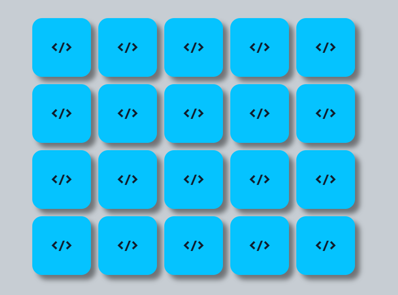
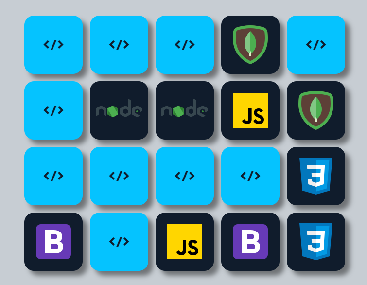

<h3>Jogo da memória JS</h3>  
Dev: Denis Yarley  
Git: https://github.com/DenisYarleyDev  
Versão:  1.0  
data: 09/10/2024  

preview: https://memorygamejs.free.nf/

<h3>Lógica de game:</h3>
Sempre que o jogo for reiniciado as cartas mudarão de posição de forma aleatória proporcioanndo sempre um tabuleiro diferente para cada novo jogo com 2.375.880.867.360.000 combinações possíveis.   

Após selecionar cartas que não são pares as cartas viram novamente e ficam ocultas.

Após selecionar cartas que são pares as cartas permanecem desviradas ao jogador confirmando que ele encontrou um par.    

Ao encontrar o maximo de 10 pares o game exibe uma tela para jogar novamente    

<h3>Objetivo:</h3>
Encontrar e formar a maior quantidade de pares possíveis com base na logica do jogo da memoria.

